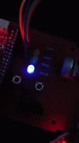

# **Simulasi Penjadwalan Preemptive Berbasis Prioritas dengan LED Tasks**

Proyek ini merupakan simulasi sistem tertanam dengan multitasking menggunakan kebijakan penjadwalan preemptive berbasis prioritas. Dua tugas yang mengontrol LED digunakan untuk memperlihatkan efek preemption, di mana tugas dengan prioritas lebih tinggi dapat menghentikan tugas prioritas lebih rendah.

## **Deskripsi Proyek**
Proyek ini dirancang untuk memberikan pemahaman kualitatif terhadap perilaku multitasking dengan skenario penjadwalan preemptive. Simulasi dilakukan dengan dua tugas berikut:
- **FlashGreenLedTask:** Mengontrol LED Hijau dan Biru.
- **FlashRedLedTask:** Mengontrol LED Merah dan Oranye.

LED Hijau dan Merah akan berkedip selama eksekusi tugas berlangsung. Jika terjadi preemption, LED Hijau atau Merah akan menyala terus menerus (on atau off), menunjukkan bahwa tugas tersebut sedang dihentikan sementara.

## **Komponen yang Digunakan**
- **Mikrokontroler:** STM32F103
- **LED:**
  - Biru: Indikator tugas siap atau aktif
  - Hijau: Indikator eksekusi tugas FlashGreenLedTask
  - Oranye: Indikator tugas siap atau aktif
  - Merah: Indikator eksekusi tugas FlashRedLedTask
- **Timer:** Mengontrol waktu tugas
- **RTOS:** Mengelola multitasking dan penjadwalan tugas (menggunakan CMSIS-RTOS)

## **Fitur Utama**
- **Penjadwalan Preemptive:** Menunjukkan interaksi antara tugas prioritas tinggi dan rendah.
- **Simulasi Multitasking:** Dua tugas berjalan secara paralel dengan prioritas berbeda.
- **Pengamatan Visual:** Preemption dapat diamati melalui pola nyala LED.
- **Analisis Utilisasi Prosesor:** Memungkinkan perhitungan efisiensi penggunaan prosesor.

## **Pengaturan**
1. **FlashGreenLedTask**
   - **Waktu Periodik:** 10 detik
   - **Waktu Eksekusi:** 4 detik
   - **Frekuensi Toggle LED Hijau:** 20 Hz
   - **Prioritas:** Dapat diatur ulang dalam eksperimen
   
2. **FlashRedLedTask**
   - **Waktu Periodik:** 2 detik
   - **Waktu Eksekusi:** 0,5 detik
   - **Frekuensi Toggle LED Merah:** 20 Hz
   - **Prioritas:** Dapat diatur ulang dalam eksperimen

## **Cara Menggunakan**

## **Diagram System**

## Uji Coba

